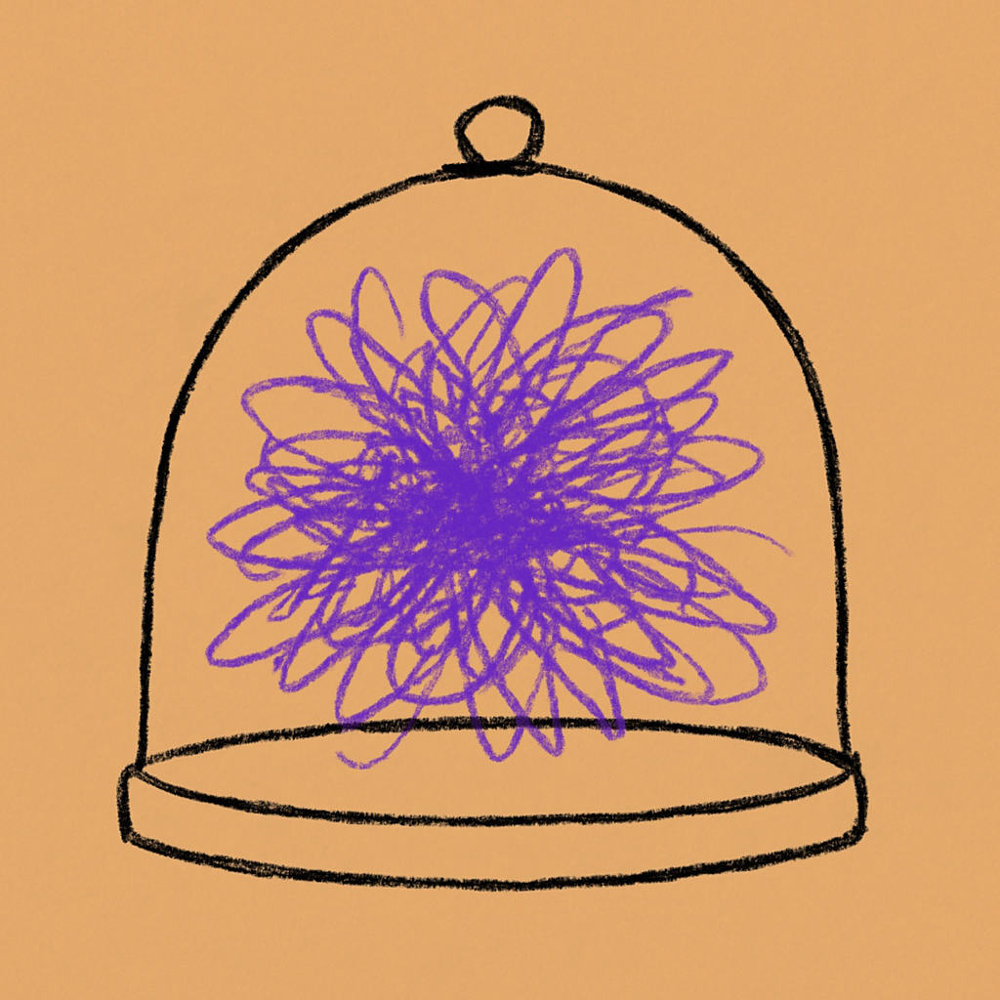
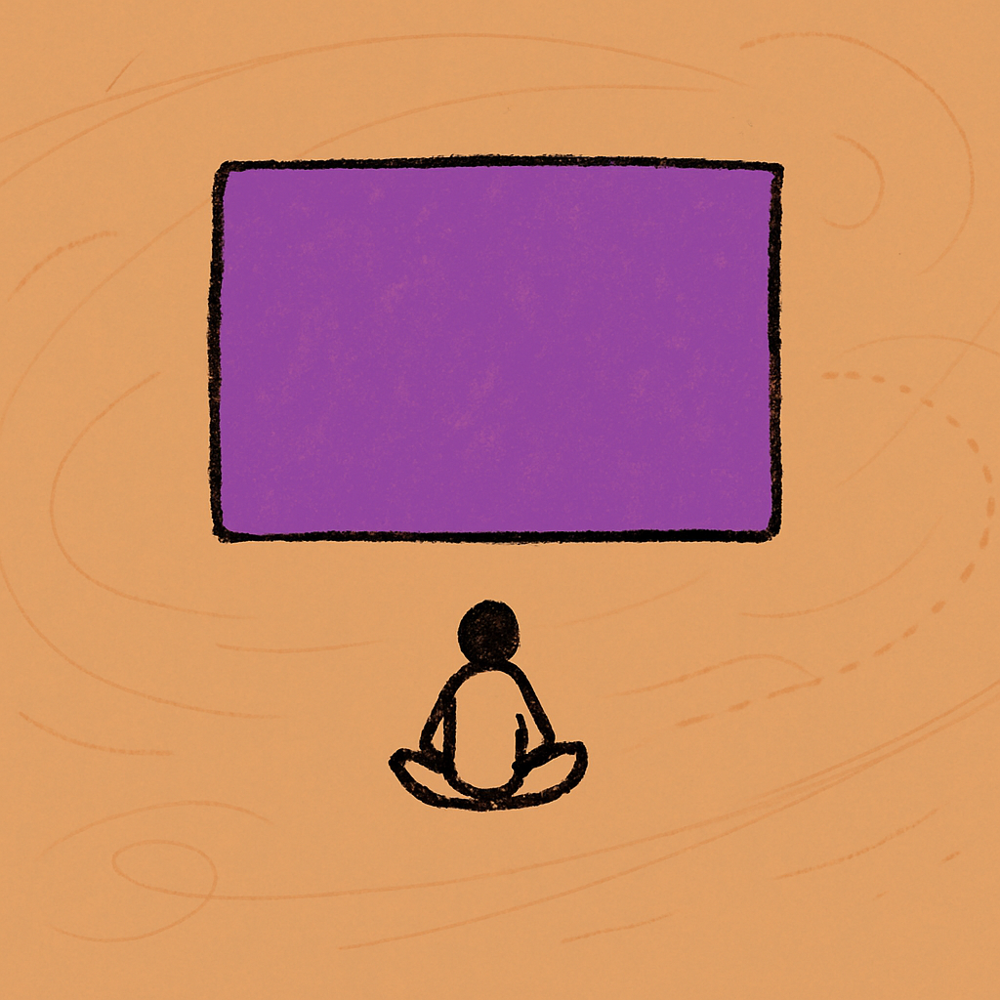

# clip_06 v3 preview

## 🎬 Video (overlay architecture + cue-aligned + LXGW WenKai font)

Stream: https://github.com/pretenditsacity/arcpod-clip06-v3-preview/raw/master/video.mp4

## What changed since v2

- **Cue alignment**: each image enters at the exact SRT timestamp where speaker introduces it (魔鬼 at 35.24s, 电影 at 54.06s, etc.). No more uniform `duration/N` slicing. First 3.86s = sepia + subtitle only (intro lead-in).
- **Square 1:1 image + sepia padding**: image is 1024×1024 top-anchored in a 1024×1820 sepia frame. The "lower band empty for subtitle" is now a deterministic ffmpeg pad, not a wishful prompt instruction.
- **Overlay (not xfade)**: each image is an independent ffmpeg overlay enabled in its [cue_at, next_cue_at] window. Sepia base layer continuous beneath.
- **Vivid-anchor rule landed**: scene 3 picked **魔鬼** as the anchor (instead of safe "printing press + alarmed clergy") — small horned devil with pitchfork sitting on top of printing press. This is the breakthrough you flagged.
- **LXGW WenKai 霞鹜文楷**: subtitle font replaces Heiti SC. Black ink (no outline) on sepia, matches Klassen literary-book aesthetic. Font loaded via libass fontsdir from `data/fonts/`, not system install.

---

# clip_06 — spike_ref (5 images, accent=purple)

**Duration:** 61.7s
**Accent rationale:** The clip is about digital anxiety, cultural entropy, and the loss of deep attention — purple captures the melancholy and unease of a civilization in slow cognitive decline.

---

## image 01 — cue_at: 3.86s — mode: concrete — anchor: `封闭系统/熵增`

**Transcript slice:**
> 00:00:03,860 --> 00:00:05,680
文化熵增

00:00:06,940 --> 00:00:07,740
你看啊

00:00:07,740 --> 00:00:09,640
热力学第二定律说什么

00:00:09,640 --> 00:00:10,680
封闭系统里面

00:00:10,680 --> 00:00:12,340
熵只会增加

00:00:12,800 --> 00:00:14,740
就是混乱度只会上升

**Viewer reads as:** 一个密封容器里面越来越混乱

**Scene prompt:**
> A single sealed glass dome sits centered on the canvas, its interior filled with tangled, chaotic scribble-lines radiating outward from center — dense and knotted near the middle, wild and fraying toward the dome walls. The outside of the dome is perfectly empty sepia space. The dome's outline is drawn with rough, wobbly ink.

---

## image 02 — cue_at: 21.14s — mode: concrete — anchor: `模仿者淹没`

**Transcript slice:**
> 00:00:21,140 --> 00:00:22,220
一个好的idea出来

00:00:22,220 --> 00:00:23,940
瞬间被一千个模仿者淹没

**Viewer reads as:** 一根高蜡烛被无数缩小的复制蜡烛包围淹没

**Scene prompt:**
> One tall, upright candle with a bright accent-colored flame stands at the center. Radiating outward from it in concentric rings are dozens of progressively smaller, near-identical candles, each slightly more slumped and dim than the last, crowding the frame toward the margins. The sheer multiplication of copies overwhelms the single original.

---

## image 03 — cue_at: 35.24s — mode: concrete — anchor: `魔鬼`

**Transcript slice:**
> 00:00:35,240 --> 00:00:37,000
教会说这是魔鬼的工具

00:00:37,780 --> 00:00:38,540
然后呢

00:00:38,540 --> 00:00:40,300
然后我们发展出了版权法

00:00:40,320 --> 00:00:41,140
出版伦理

00:00:41,300 --> 00:00:42,140
学术规范

00:00:42,700 --> 00:00:44,680
这些都是人性的解决方案

00:00:44,680 --> 00:00:46,620
不是技术的

**Viewer reads as:** 一个小恶魔坐在印刷机上面

**Scene prompt:**
> A squat, naive horned devil figure — small horns, stubby tail, pitchfork — perches triumphantly atop a chunky hand-drawn printing press, arms spread wide. The press and devil together form one compact centered vignette surrounded by generous empty sepia. The devil is filled with the accent color.

---

## image 04 — cue_at: 50.24s — mode: literal_anchor — anchor: `注意力`

**Transcript slice:**
> 00:00:50,240 --> 00:00:51,840
是一整代人的注意力

00:00:52,160 --> 00:00:53,500
是深度思考的能力

**Viewer reads as:** 一个人的头颅里空空荡荡,什么都流走了

**Scene prompt:**
> A single naive human head silhouette in profile, centered on the canvas. The interior of the skull is hollow and empty, with only a few loose wispy dotted lines drifting upward and out through the top of the head, dissolving into the sepia void above. Nothing else in the frame.

---

## image 05 — cue_at: 54.06s — mode: literal_anchor — anchor: `电影`

**Transcript slice:**
> 00:00:54,060 --> 00:00:56,640
是那种愿意花两个小时看一部电影

00:00:56,640 --> 00:00:58,760
而不是五分钟看解说的耐心

00:00:59,140 --> 00:01:00,380
这个东西一旦失去了

00:01:00,380 --> 00:01:01,680
要花多久才能重建

**Viewer reads as:** 一个小人坐在大银幕前专心看电影

**Scene prompt:**
> A single tiny naive human silhouette sits cross-legged at the bottom-center of the canvas, facing a large, plain rectangular screen that towers above it. The screen glows with a flat accent-color fill. The figure is dwarfed by the screen, emphasizing stillness, patience, and sustained attention.

